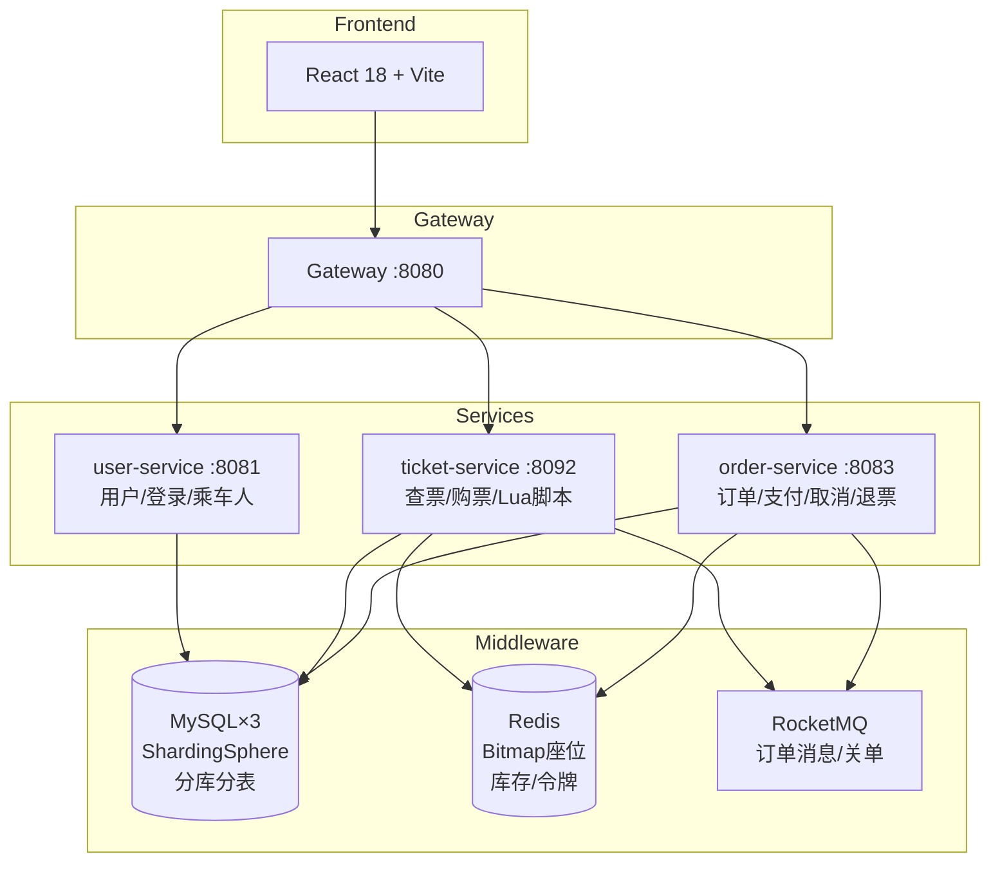
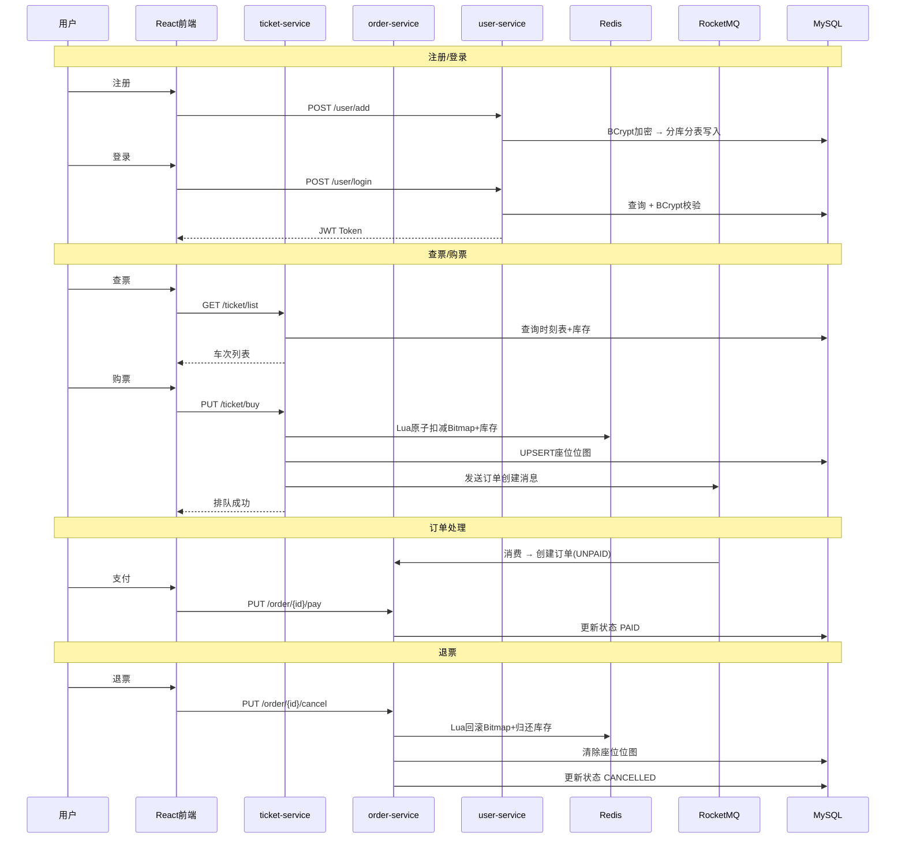

# 12306Pro — 火车票预订系统

仿 12306 的微服务火车票预订平台，支持查票、购票、支付、退票、乘车人管理。

**Spring Boot 3.5 + ShardingSphere 分库分表 + Redis Bitmap 座位管理 + RocketMQ + React 19**

🚄 940 趟真实车次 · 169 个全国站点 · 35+ 条高铁线路

---

## 架构概览



### 微服务调用关系



---

## 技术栈

| 层级 | 技术 | 说明 |
|------|------|------|
| 后端框架 | Spring Boot 3.5.10 | Java 21 |
| 分库分表 | ShardingSphere 5.5.2 | 3库18表，phone 分片键 |
| ORM | MyBatis-Plus 3.5.10 | Lambda 查询 |
| 缓存 | Redis + Caffeine | Lettuce 客户端 |
| 消息队列 | RocketMQ 5.3 | 订单创建/过期关单 |
| 认证 | JWT (jjwt 0.12.6) | BCrypt 密码加密 |
| 分布式锁 | Redisson 3.38 | 布隆过滤器防用户名重复 |
| 前端 | React 18 + Vite 8 | React Router 7 |
| 构建 | Maven 多模块 | common/user/ticket/order/gateway |

---

## 项目结构

```
12306Pro/
├── common/              # 公共模块（实体/DTO/VO/工具类）
├── gateway/             # API 网关
├── user-service/        # 用户服务 :8081
│   ├── 用户注册/登录（JWT + BCrypt）
│   ├── 乘客管理 CRUD
│   └── 个人资料/改密
├── ticket-service/      # 票务服务 :8092
│   ├── 车次查询（城市/拼音搜索）
│   ├── 购票（Redis Lua 原子扣减）
│   └── 15天滑动窗口时刻表生成
├── order-service/       # 订单服务 :8083
│   ├── 订单创建/支付/取消/退票
│   └── 超时关单（RocketMQ 延迟消息）
└── frontend/            # React 前端
    ├── 查票/购票/订单
    ├── 乘车人管理（CRUD + 身份证校验）
    └── 个人资料/登录注册
```

---

## 核心亮点

### 1. ShardingSphere 分库分表
- 3 个物理库 × 6 张物理表 = 18 个分片节点
- `phone` 作为分片键，路由表支持用户名登录
- 雪花算法全局 ID 生成

### 2. Redis Bitmap 座位管理
- 每个座位用 BITFIELD 存储区间占用状态（1bit = 1区间）
- Lua 脚本保证 Bitmap 扣减 + 库存 + 令牌的原子性
- 购票冲突时自动修复 Redis/MySQL 数据一致性

### 3. 消息队列异步处理
- 购票请求通过 RocketMQ 异步创建订单，削峰填谷
- 30分钟未支付自动关单（延迟消息）
- 退票同步回滚 Redis 座位 + 归还库存

### 4. 身份证校验
- 注册和乘车人管理中校验 18 位身份证校验码（GB 11643-1999）
- 前17位加权和 mod 11 验证

---

## 快速启动

### 环境要求

- JDK 21+
- Maven 3.9+
- MySQL 8.0 × 3（端口 3306/3307/3308）
- Redis（端口 6379）
- RocketMQ 5.x（NameServer :9876）
- Node.js 18+

### 1. 初始化数据库

```sql
-- 每个 MySQL 实例执行
CREATE DATABASE IF NOT EXISTS db_0;
CREATE DATABASE IF NOT EXISTS db_1;
CREATE DATABASE IF NOT EXISTS db_2;
```

导入 seed 数据：
```bash
mysql -u root -p -h localhost -P 3306 db_0 < user-service/src/main/resources/db/passenger_ddl.sql
mysql -u root -p -h localhost -P 3306 db_0 < ticket-service/src/main/resources/db/station_seed.sql
```

### 2. 启动后端

```bash
# 编译公共模块
mvn install -pl common -DskipTests

# 启动服务（分别在不同终端）
mvn spring-boot:run -pl user-service
mvn spring-boot:run -pl ticket-service
mvn spring-boot:run -pl order-service
```

### 3. 启动前端

```bash
cd frontend
npm install
npm run dev
```

访问 http://localhost:3000

---

## 主要功能

| 功能 | 说明 |
|------|------|
| 用户注册/登录 | 手机号+用户名双模式，JWT认证，密码显隐，记住我 |
| 车次查询 | 城市/站名/拼音搜索，出发到达互换 |
| 购票 | 座位类型选择，从已保存乘车人勾选或手动输入 |
| 模拟支付 | 支付方式选择、网关延迟模拟、交易号生成 |
| 管理后台 | 车次模板/站点字典/数据统计面板 |
| Swagger 文档 | SpringDoc OpenAPI，各服务独立文档页 |
| 健康检查 | Spring Boot Actuator，各服务 /actuator/health |
| 订单管理 | 待支付/已支付/已取消，支付/取消/退票 |
| 乘车人管理 | CRUD，身份证校验码验证，成人/学生/儿童类型 |
| 个人资料 | 头像、脱敏信息、改手机号/密码 |
| 表单校验 | 手机号格式、密码强度条、身份证校验码 |
| Toast 通知 | 替代 alert，操作反馈 |

---

## 数据库设计

- **user** — 分库分表（3×6），phone 分片键
- **username_phone** — 单表，用户名→手机号路由映射
- **train_template** — 车次模板
- **train_template_stopover** — 经停站
- **train_schedule** — 每日时刻表（15天滑动窗口）
- **train** — 具体列车实例
- **orders** — 订单表
- **order_passenger** — 订单-乘车人关联
- **seat_bitmap** — 座位区间占用位图（MySQL 副本）
- **passenger** — 常用乘车人

---

## License

MIT
