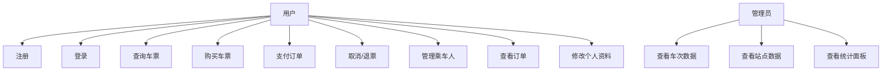

# 12306Pro 需求分析

## 1. 项目背景

仿 12306 火车票预订系统，面向日常购票场景。核心挑战在于：座位不是单一商品，而是按区间拆分的组合商品——同一座位可售给不同区间的乘客，但不能重叠。这使库存模型、并发控制、查询性能都比普通电商系统复杂得多。

## 2. 功能需求

### 2.1 用户模块

| 功能 | 描述 |
|------|------|
| 注册 | 手机号 + 用户名 + 密码，BCrypt 加密存储 |
| 登录 | 用户名/手机号双模式，返回 JWT Token |
| 个人资料 | 查看、修改基本信息（姓名、手机号） |
| 修改密码 | 验证旧密码后更新 |
| 乘车人管理 | CRUD，支持成人/学生/儿童类型，身份证校验码验证 |

### 2.2 票务模块

| 功能 | 描述 |
|------|------|
| 站名搜索 | 支持城市名、站名、拼音、首字母搜索 |
| 城市索引 | 按拼音首字母分组展示所有城市 |
| 车票查询 | 按日期 + 出发站 + 到达站查找所有可乘车次 |
| 车票购买 | 选座位类型 + 选择乘车人 → 下单 |
| 排期管理 | 15 日预售窗口，每日凌晨自动推进 |

### 2.3 订单模块

| 功能 | 描述 |
|------|------|
| 创建订单 | RocketMQ 异步消费 ticket-service 的购票消息 |
| 支付 | 确认支付，状态 UNPAID → PAID |
| 取消/退票 | 回滚 Redis 位图 + MySQL 座位，状态 → CANCELLED |
| 超时关单 | 30 分钟未支付自动取消（RocketMQ 延迟消息） |
| 订单列表 | 按用户查看历史订单，按状态筛选 |

### 2.4 管理模块

| 功能 | 描述 |
|------|------|
| 数据统计 | 车次模板数、站点数、经停记录数 |
| 车次查看 | 所有模板及经停站详情 |
| 站点查看 | 所有站点字典 |

## 3. 非功能需求

| 维度 | 要求 |
|------|------|
| 并发 | 查票 10,000+ QPS，购票 1,500+ QPS（单机压测） |
| 延迟 | 查票 P99 < 20ms，购票 P99 < 30ms |
| 数据一致性 | Redis 与 MySQL 座位状态最终一致，冲突自动检测修复 |
| 可用性 | Redis 故障时可降级到 MySQL 查询 |
| 可扩展性 | 微服务架构，各服务独立部署和扩容 |
| 存储效率 | 座位信息用位图存储，每个座位每区间仅 1 bit |

## 4. 用例图

