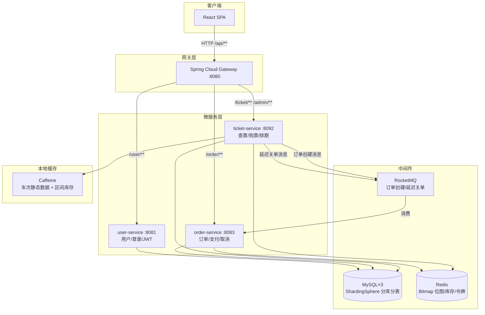
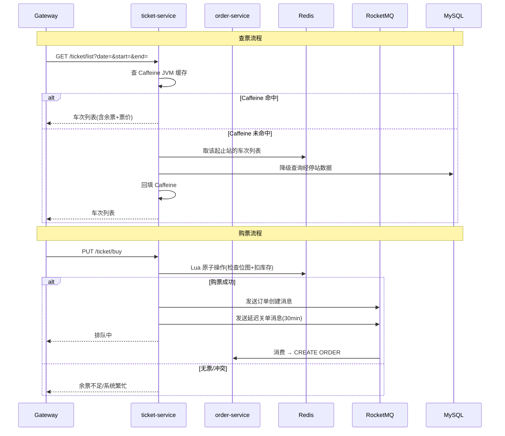

# 12306Pro 概要设计

## 1. 系统架构



## 2. 模块划分

### 2.1 模块职责

| 模块 | 端口 | 职责 |
|------|------|------|
| gateway | 8080 | API 路由、统一入口 |
| common | - | 公共实体、DTO、异常处理、Result 封装 |
| user-service | 8081 | 注册/登录、JWT 签发与校验、乘车人管理、个人资料 |
| ticket-service | 8092 | 站名搜索、车票查询、购票（Lua 原子扣减）、15 日排期窗口 |
| order-service | 8083 | 订单创建（消费 MQ）、支付、取消/退票、超时关单、数据冲突修复 |
| frontend | 5173 | React SPA，8 个页面 |

### 2.2 模块间调用关系



关键设计决策：ticket-service 与 order-service **不直接调用**，通过 RocketMQ 异步解耦。购票响应不等待订单落库完成。

## 3. 技术选型

| 层级 | 技术 | 版本 | 选型理由 |
|------|------|------|----------|
| 后端框架 | Spring Boot | 3.5.10 | 生态成熟，自动配置完善 |
| API 网关 | Spring Cloud Gateway | 2024.0.1 | 与 Spring 生态无缝集成 |
| ORM | MyBatis-Plus | 3.5.10 | Lambda 查询，批量插入支持 |
| 分库分表 | ShardingSphere | 5.5.2 | 3 库 18 表，phone 分片键 |
| 缓存 | Redis + Caffeine | 8.0 / 3.x | Redis 做分布式位图和库存，Caffeine 做本地热数据 |
| 分布式锁 | Redisson | 3.38.0 | Watchdog 自动续期，避免死锁 |
| 消息队列 | RocketMQ | 5.x | 高吞吐、延迟消息支持 |
| 认证 | jjwt | 0.12.6 | 轻量 JWT 库 |
| 加密 | Spring Security Crypto | - | BCrypt 密码哈希 |
| 前端 | React + Vite | 19 / 8 | 快速 HMR，轻量 SPA |
| API 文档 | SpringDoc OpenAPI | 2.8.10 | 零注解自动生成 |
| 监控 | Spring Boot Actuator | - | 健康检查端点 |

## 4. 数据库分片设计

### 4.1 分片策略

- **3 个物理库**：db_0 (3306)、db_1 (3307)、db_2 (3308)
- **user 表**：按 `phone` 分库（`phone % 3`）、按 `phone.intdiv(3) % 6` 分表，共 18 个物理分片
- **其他表**：通过 `!SINGLE` 规则路由到 ds_0，不参与分片
- **主键生成**：雪花算法，worker-id 固定为 123

### 4.2 核心表

```
station_dict          — 站点字典（站名/城市/省份/拼音）
train_template        — 车次模板（车号/线路/各等级车厢数）
train_template_stopover — 模板经停站（站序/时刻/里程）
train_stopover        — 每日经停站（从模板生成，15 天滑动窗口）
schedule_window       — 售票窗口（起始日/结束日）
seat_bitmap           — 座位位图表（MySQL 真相源）
ticket_outbox         — 本地消息表（订单消息可靠性保证）
orders                — 订单表（用户/车次/座位/状态）
order_passengers      — 订单乘车人关联表
```

## 5. Redis 数据结构

| Key 模式 | 类型 | 内容 | 示例 |
|----------|------|------|------|
| `TrainStop:{date}:{code}` | String | 车次详情 JSON | 经停站、车厢、库存状态 |
| `Stock:{date}:{code}:{seat}` | Hash | `{section→stock}` | 每区间剩余票数 |
| `{date}:{code}:{seat}:bitmap` | String | 二进制位图 | 每个座位每区间 1 bit |
| `Token:{date}:{code}:{seat}` | String | 令牌桶计数 | 购票限流 |
| `{date}:{start}:{end}` | List | 经过该区间的车次编号 | 快速匹配 |
