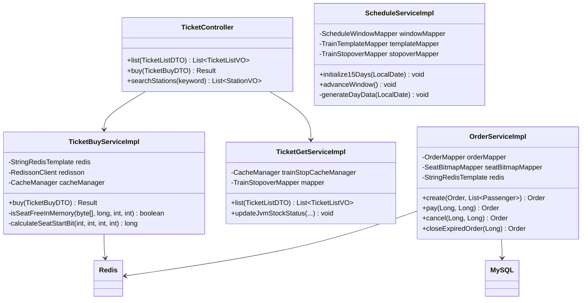
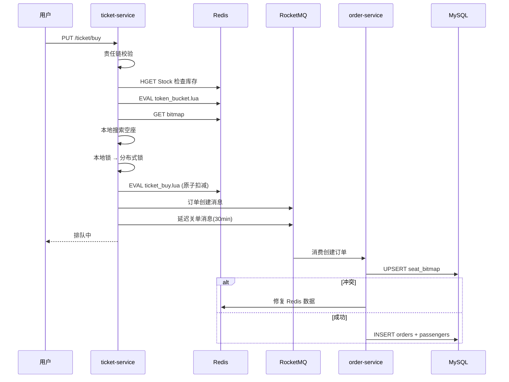

# 12306Pro 详细设计

## 1. 座位位图模型

### 1.1 问题本质

火车票不同于普通电商商品。一个座位从北京到广州，中途经过 5 个区间。乘客 A 买北京→武汉（区间 1-2），乘客 B 买长沙→广州（区间 4-5）——两人共用同一座位，但不冲突。这是典型的**组合商品区间重叠判断**问题。

### 1.2 位图结构

采用**行式（seat-major）**布局：先按座位排列，每个座位内再按区间排列。

```
二等座车厢（90 座，4 个区间）：

座位1: [bit0  bit1  bit2  bit3]   ← 区间 1,2,3,4
座位2: [bit4  bit5  bit6  bit7]
座位3: [bit8  bit9  bit10 bit11]
  ...
座位90:[bit356 ... bit359]

总位数 = 90座 × 4区间 = 360 bits = 45 bytes
```

座位 k 在区间 s 的 bit 位置：

```
bit_pos = (k - 1) × totalSections + (s - 1)
```

### 1.3 为什么选行式而非列式

列式（先按区间排，再按座位排）在"连买多个区间"时有优势——可以一次 `Long.numberOfLeadingZeros()` 找到空位。但写入时需要跨多个区间段分别写，Redis 操作次数增加 N 倍。

当前系统读（搜索空位）远多于写（购票成功后的位图更新），且 Redis 网络 IO 是瓶颈。列式是未来优化方向，但需要配合"本地位图缓存"才能发挥优势。

## 2. Redis 缓存预热

### 2.1 预热时机

系统启动时，`DataInitRunner`（实现 `ApplicationRunner`）同步执行预热，完成前服务不对 HTTP 请求就绪：

```
启动 → Spring 上下文就绪 → DataInitRunner.run()
  → initialize15Days(今天)
    → 每天 generateDayData()  × 15 天（或追补）
      → 对 981 个车次模板 × 每个：
        1. Redis String: TrainStop:{date}:{code} → 车次详情 JSON
        2. Redis Hash:  Stock:{date}:{code}:{seat}  → 各区间初始库存
        3. Redis String: {date}:{code}:{seat}:bitmap → 全零位图
        4. Redis String: Token:{date}:{code}:{seat}  → 令牌桶初始值
        5. Redis List:  {date}:{start}:{end} → 车次列表
        6. MySQL: train_stopover 批量 INSERT
```

### 2.2 追补机制

```java
public void initialize15Days(LocalDate fromDate) {
    ScheduleWindow existing = windowMapper.selectById(1);
    LocalDate expectedEnd = fromDate.plusDays(14);

    if (existing == null || existing.getWindowEnd() == null) {
        // 首次启动：生成 15 天
        for (int i = 0; i < 15; i++) generateDayData(fromDate.plusDays(i));
        windowMapper.insert(new ScheduleWindow(1, fromDate, expectedEnd));
    } else if (existing.getWindowEnd().isBefore(expectedEnd)) {
        // 窗口过期：追补缺失天数
        for (LocalDate d = existing.getWindowEnd().plusDays(1);
             !d.isAfter(expectedEnd); d = d.plusDays(1)) {
            generateDayData(d);
        }
        existing.setWindowStart(fromDate);
        existing.setWindowEnd(expectedEnd);
        windowMapper.updateById(existing);
    }
}
```

### 2.3 本地缓存（Caffeine）

- **容量**：`maximumSize=10000`，超出时 W-TinyLFU 淘汰
- **刷新**：`refreshAfterWrite=10min`，写入 10 分钟后下次访问时异步刷新
- **过期**：`expireAfterAccess=1day`
- **加载方式**：懒加载。查询时先从 Caffeine 取，未命中则降级 MySQL，取到后回填

## 3. 购票流程

### 3.1 请求处理流水线

```
PUT /ticket/buy
  → 责任链校验（参数→站点→车次信息）
  → Redis 库存快速检查
  → Token 桶限流
  → 拉取 Redis 位图
  → 随机起始位置搜索空座（自适应熔断）
  → 双锁机制（本地锁 → 分布式锁）
  → Lua 原子扣减（位图 + 库存）
  → RocketMQ 发送订单创建消息 + 延迟关单消息
```

### 3.2 搜索算法

```java
// 自适应熔断：票多时限制搜索次数，票少时放开
int maxAttempts = (minStock < passengerCount * 3)
    ? Integer.MAX_VALUE   // 票少：不限制
    : 100;                // 票多：最多搜 100 次

// 随机起点避免"扫到末尾全是已售"的退化
int startPos = ThreadLocalRandom.current().nextInt(totalSeats);

for (int offset = 0; offset < totalSeats && attempts < maxAttempts; offset++) {
    int pos = (startPos + offset) % totalSeats;
    // 一次提取 1-3 字节，一次 AND 判断空闲
    if (isSeatFreeInMemory(bitmapBytes, seatStartBit, startSection, endSection)) {
        attempts++;
        // 拿到锁 → Lua 最终裁判
        if (luaResult == 1) break; // 买到
    }
}
```

### 3.3 双锁机制

```
第一道：本地 ReentrantLock（JVM 内互斥，无网络开销）
   ↓ 拿到
第二道：Redisson 分布式锁（跨 JVM 互斥，Watchdog 自动续期）
   ↓ 拿到
Lua 脚本原子操作（最终裁判）
```

锁的粒度为**座位级**：`Lock:{date}:{code}:{seatType}:{carriage}:{seat}`。相比按车厢或按座位类型加锁，并发度最高。

### 3.4 Lua 原子操作

```lua
-- ticket_buy.lua
local bitmap_key = KEYS[1]
local stock_key  = KEYS[2]
local seat_start_bit = ARGV[1]
local start_section  = ARGV[2]
local end_section    = ARGV[3]
local total_sections = ARGV[4]
local passenger_count = ARGV[5]
local sections_json   = ARGV[6]

-- 1. 检查位图区间是否空闲
-- 2. 空闲 → 置位 + 扣库存
-- 3. 返回: 1=成功, 0=已被占, -2=异常
```

## 4. 数据一致性保证

### 4.1 两层真相源

| 层级 | 角色 | 一致性 |
|------|------|--------|
| Redis | 实时操作层（位图 + 库存） | 最终一致 |
| MySQL seat_bitmap | 真相源（订单落库时写入） | 强一致 |

### 4.2 冲突检测与修复

订单落库时，`OrderServiceImpl.create()`：

```
1. 构建区间掩码（用户购买区间的 bit 置 1）
2. MySQL UPSERT seat_bitmap：
   UPDATE seat_bitmap SET bitmap = bitmap | mask WHERE ...
   如果 affected rows = 0 → 冲突（有人已经买了重叠区间）
3. 冲突修复：
   - 对比 MySQL 位图与用户请求的掩码
   - 找出 dirty 区间（MySQL 有但 Redis 没有）→ Redis 补标记
   - 找出 clean 区间（用户想买但 MySQL 已被占）→ Redis 回滚
   - 修正 Redis 库存和令牌
```

### 4.3 Outbox 模式

购票成功后向 `ticket_outbox` 表写一条 PENDING 消息，同时发 RocketMQ。定时任务 `OutboxRetryScheduler` 每 30 秒重试 PENDING 状态的消息，保证消息不丢。

## 5. 售票窗口滑动

```
schedule_window 表（id=1, window_start, window_end）

正常运行：每天凌晨 2:00
  ScheduleAdvanceJob.advanceWindow()
    → 生成 window_end + 1 的数据
    → 窗口右移 1 天

重启追补：DataInitRunner 检测到 window_end < 今天 + 14
    → 追补所有缺失天数
    → 窗口重置为 今天 → 今天 + 14
```

## 6. 核心类图



## 7. 购票时序


